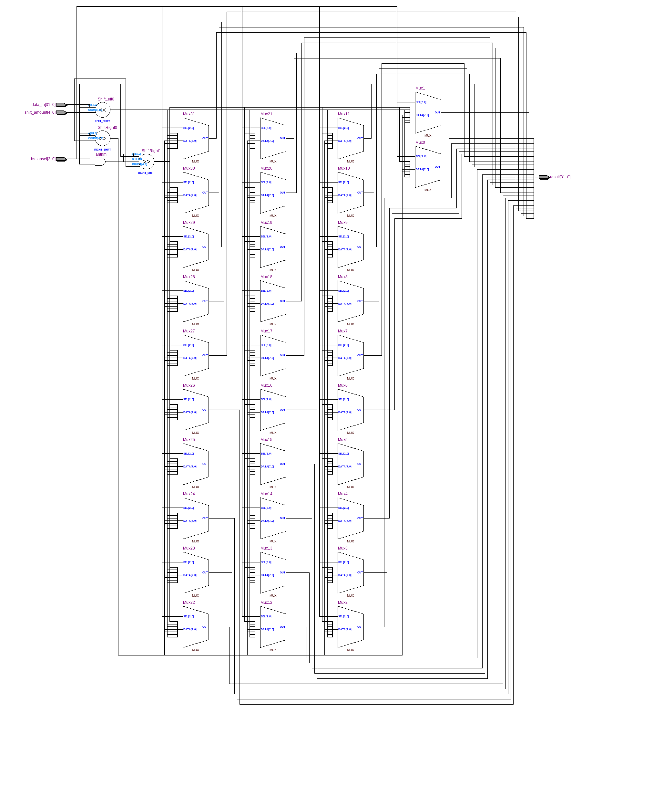
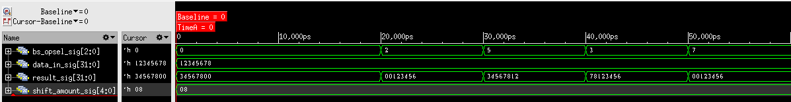

=============================================
Лабораторна робота №3
=============================================

Тема
------

Проектування та реалізація здвигового регістру (арифметичний, логічний зсув).

Хід роботи
-------

**Теоретичні відомості** 
Регістри зсуву - ряд послідовно з'єднаних трігерів двоступеневої структури. 
Число трігерів визначає розрядність коду, що записується. За напрямком зсуву 
записаної в регістр інформації розрізняють регістри прямого зсуву, тобто вправо, в 
сторону молодшого розряду, зворотнього зсуву, тобто вліво, в сторону старшого розряду.

**Реалізація проекту.**  Для реалізації даного пристрою використовувалась мова опису апаратури Verilog.
Проект складаєтья з мультиплексорів та елементів (<<) (>>) (>>>),
які й виконують логічний зсув вліво, вправо, та арифметичний зсув вправо відповідно.
Для вибору зсуву використовуємо оператор casez, так як він, на відміну від case підтримує don't care.

Рис.1 RTL схема даного проекта.

Рис.2 Результати симуляції.

Висновки
-------

На даній лабораторній роботі реалізовано регістр зсуву на базі мультиплексорів. Регістри зсуву використовуються 
в схемах множення і ділення: зсув числа уліво (вправо) на один розряд відповідає його множенню (діленню) на два,
для побудови дільників імпульсів, лічильників. Результат, отриманий під час симуляції регістру зсуву задоволняє 
поставлені задачі ( виконуються всі види зсуву на різну кількість розрядів), отже можна зробити 
висновок що поставлена задача виконана. 

