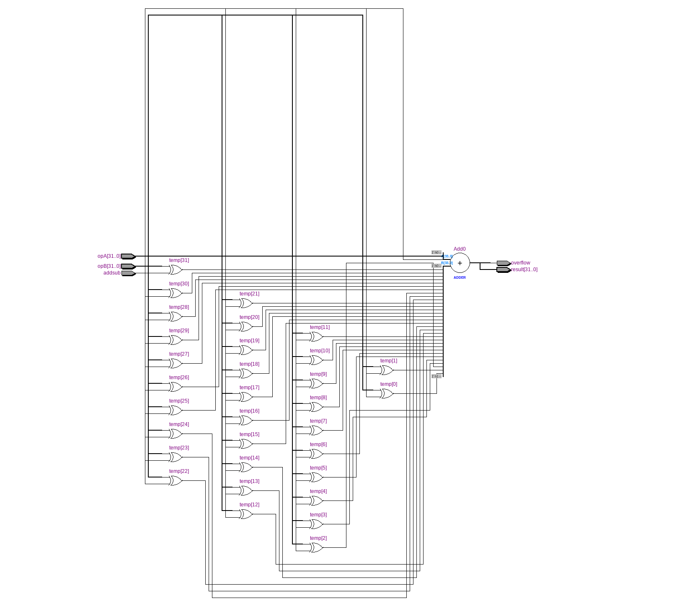
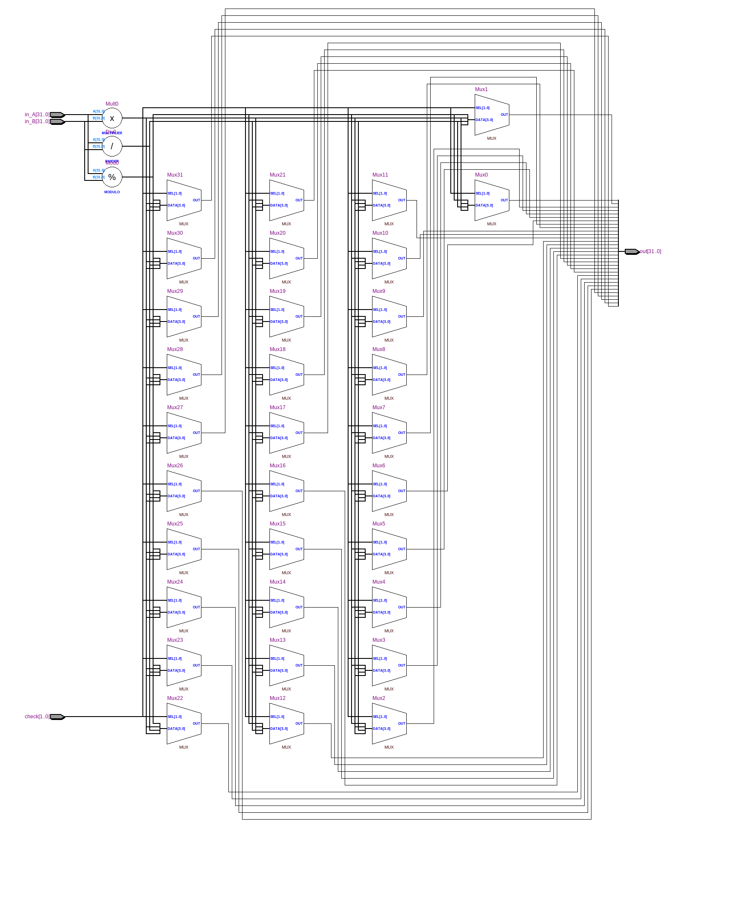
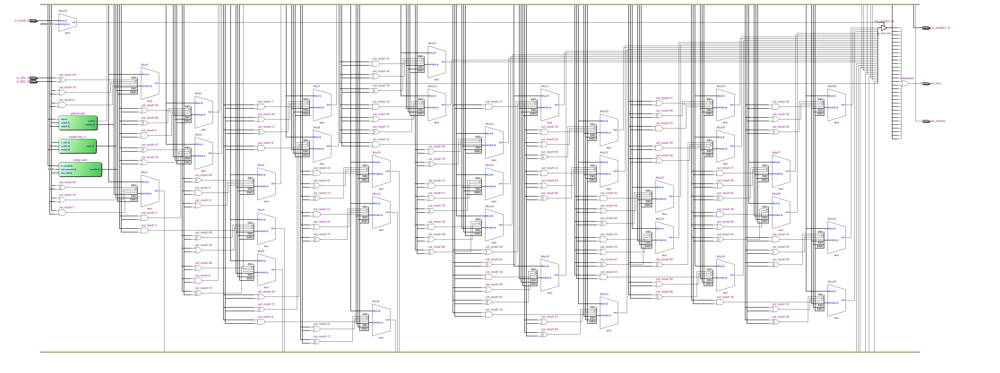
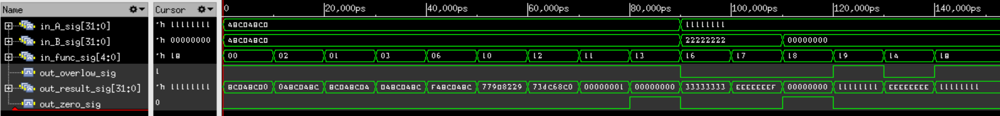

=============================================
Лабораторна робота №4
=============================================

Тема
------

Реалізація та верифікація АЛП

Хід роботи
-------

**Специфікація** Пристрій повинен виконувати такі операції:
	- Логічний та циклічний зсуви вправо та вліво, арифметичний зсув вправо
	- Додавання та віднімання знакових і беззнакових чисел
	- Множення і ділення цілих чисел
	- Бітові операції AND, NOR, XOR та OR
Також пристрій повинен мати вихідні сигнали overflow та zero.

**Створення проекту** Проект було вирішено створювати на мові Verilog, тому що це зайняло набагато менше часу, ніж створення схеми
у схемному редакторі. Для спрощення роботи над пристроєм мною було вирішено кожну дію виконати в окремому файлі, що дуже сильно спростило
відладку пристрою. Також тут було використано, barrel shifter з попередньої лабораторної роботи, який не потребував відладки, що також трохи спростило створення та відладку пристрою. 
Потім мною було написано тестовий файл на мові Verilog, що допомогло відладити пристрій.

**Опис пристрою** Мій АЛП має 2 входи данних, та один вихід данних, при операціях множення та ділення виконується додаткова операція для виведення старших розрядів результату (у випадку, якщо
при множенні результат не поміщається в 32 біт) або остачі від ділення( при діленні)  . Також пристрій має 2 виходи прапорців:
	-> overflow - прапорець переповнення( використовується лише при додаванні та відніманні)
	-> zero - прапорець нуля(якщо результат нульовий, zero = 1)
Операція, яку повинен виконати АЛП задається п'ятьма бітами адреси, де старші два біти відповідають за "тип" операції(зсув/логіка...),
а три молодші біти задають конкретно операцію, яку ми хочемо, щоб АЛП виконав. Результат всіх операцій розміщується у out_result. 
Входи та виходи даних мають розрядність 32 біти.

Так виглядає RTL схема суматора/відніматора

Так виглядає RTL схема перемножувача/подільника

Так виглядає RTL схема АЛП

Так виглядає результат роботи АЛП

Висновки
-------

В результаті виконання даної лабораторної роботи було розроблено блок АЛП для виконання логічних та арифметичних операцій над цілими числами.
Розроблений пристрій має 32-бітний вихід (out_result), два тридцятидвох розрядні входи даних(in_A, in_B),
а також прапорці переповнення та нуля, і 5-бітний вхід адреси(завдяки якому обирається операція, яку повинен виконати АЛП).
Також в ході лабораторної роботи мною було здобуто знання з реалізації та верифікації арифметично-логічного пристрою.
В даному проекті використовувались матеріали взяті з рипозиторію Волинко Назара. Всі права захищені.

